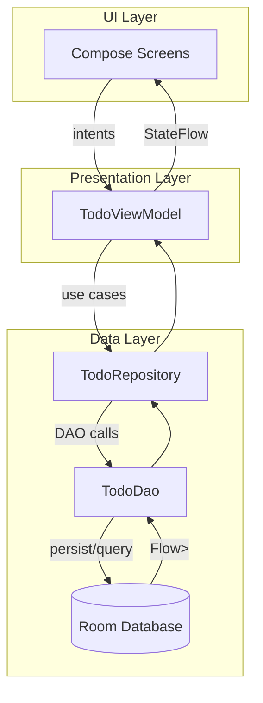
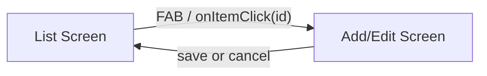

# Architecture Deep Dive

This document explains the overall architecture, design decisions, and patterns used in the project. It complements the high-level overview in [README.md](README.md).

Goals
- Simple, readable, and idiomatic Kotlin + Compose codebase
- Clear separation of concerns via MVVM and Repository
- Reactive data flow using Flow and StateFlow
- Persistent storage with Room
- Minimal DI overhead using a ServiceLocator
- Testable units across Repository and ViewModel layers

High-Level Architecture
- UI Layer (Compose)
  - Stateless composables render from immutable state
  - Emit user intents via lambdas that call ViewModel functions
- Presentation Layer (ViewModel)
  - Holds UI state as StateFlow/immutable data classes
  - Orchestrates operations to/from Repository with coroutines
  - Exposes one-off UI events via Channel/SharedFlow (snackbars, navigation)
- Data Layer (Repository + Room)
  - Repository abstracts database implementation details
  - DAO provides CRUD and observation via Flow
  - Room handles persistence, entities, and SQL

Component Diagram

Key Files
- Application and DI:
  - [app/src/main/java/com/example/todo_app/App.kt](app/src/main/java/com/example/todo_app/App.kt)
  - [app/src/main/java/com/example/todo_app/di/AppServiceLocator.kt](app/src/main/java/com/example/todo_app/di/AppServiceLocator.kt)
- Data and Repository:
  - [app/src/main/java/com/example/todo_app/data/TodoEntity.kt](app/src/main/java/com/example/todo_app/data/TodoEntity.kt)
  - [app/src/main/java/com/example/todo_app/data/TodoDao.kt](app/src/main/java/com/example/todo_app/data/TodoDao.kt)
  - [app/src/main/java/com/example/todo_app/data/TodoDatabase.kt](app/src/main/java/com/example/todo_app/data/TodoDatabase.kt)
  - [app/src/main/java/com/example/todo_app/data/TodoRepository.kt](app/src/main/java/com/example/todo_app/data/TodoRepository.kt)
- UI, ViewModel, Navigation:
  - [app/src/main/java/com/example/todo_app/ui/TodoViewModel.kt](app/src/main/java/com/example/todo_app/ui/TodoViewModel.kt)
  - [app/src/main/java/com/example/todo_app/ui/TodoScreens.kt](app/src/main/java/com/example/todo_app/ui/TodoScreens.kt)
  - [app/src/main/java/com/example/todo_app/ui/NavGraph.kt](app/src/main/java/com/example/todo_app/ui/NavGraph.kt)
  - [app/src/main/java/com/example/todo_app/MainActivity.kt](app/src/main/java/com/example/todo_app/MainActivity.kt)

Rationale and Trade-offs

1) MVVM with Repository
- Why: Separates UI logic from data access. Enables testable business logic and replacement of data sources.
- Trade-off: Requires more structure than a monolithic approach, but pays off in clarity and maintainability.

2) ServiceLocator for DI
- Why: Keep DI minimal and explicit without introducing a framework. Ideal for small-to-medium apps or demos.
- Trade-off: Manual wiring lacks compile-time graph validation; larger projects might prefer Hilt/Koin.

3) StateFlow and Flow
- Why: Unidirectional data flow from DB to UI with backpressure-conscious streams.
- Trade-off: Requires awareness of lifecycle and collection; Compose’s lifecycle-aware collection utilities simplify this.

4) Room with KSP
- Why: Type-safe persistence with compile-time validation and coroutine-friendly APIs.
- Trade-off: Schema/migration management requires discipline; codegen adds build-time overhead.

5) Navigation-Compose with String arg parsing
- Why: Compose-native navigation and a pragmatic approach to nullable arguments by using StringType and parsing to Long?.
- Trade-off: Manual parsing step; prevents crashes due to “long does not allow nullable values”.

Data Model and Persistence

Entity
- [TodoEntity.kt](app/src/main/java/com/example/todo_app/data/TodoEntity.kt): id (Long), title, description, isCompleted flag, timestamps (createdAt, updatedAt).

DAO
- [TodoDao.kt](app/src/main/java/com/example/todo_app/data/TodoDao.kt):
  - observeTodos(): Flow<List<TodoEntity>>
  - getById(id: Long)
  - insert, update, deleteById, setCompleted
- Flow from DAO feeds the list UI reactively.

Database
- [TodoDatabase.kt](app/src/main/java/com/example/todo_app/data/TodoDatabase.kt):
  - RoomDatabase singleton created by ServiceLocator
  - Versioning prepared to support future migrations

Repository
- [TodoRepository.kt](app/src/main/java/com/example/todo_app/data/TodoRepository.kt):
  - Interface hides Room details
  - Impl coordinates DAO calls and maps use-cases

Threading and Coroutines
- ViewModel uses viewModelScope for structured concurrency
- Repository and DAO methods are suspend or return Flow
- Compose collects StateFlow in a lifecycle-aware way
- Guidelines:
  - Perform DB I/O with Room’s suspend functions
  - Avoid blocking; use structured concurrency
  - Keep UI state immutable and updated atomically

State Management and One-off Events
- State:
  - List state: derived from Room Flow
  - Add/Edit state: a data class holding id?, title, description, validation
- Events:
  - ViewModel exposes one-off UI events (e.g., snackbar) using Channel/SharedFlow
  - UI collects these and shows transient messages without embedding into persistent state

Navigation
- Centralized in [NavGraph.kt](app/src/main/java/com/example/todo_app/ui/NavGraph.kt):
  - Destinations: List, Add/Edit
  - Route argument id is a nullable String; parsed to Long?
  - ViewModel invoked with startAdd or startEdit based on presence of id
- Flow:

UI Composition
- [TodoScreens.kt](app/src/main/java/com/example/todo_app/ui/TodoScreens.kt)
  - ListScreen: Scaffold with TopAppBar, LazyColumn, checkbox to toggle complete, delete actions, FAB to add
  - AddEditScreen: Text fields for title/description, validation, Save/Cancel
  - “Created by Horizon Beta Model” credit shown in empty state and as a header row
- Material3 components used throughout; styles follow defaults for simplicity.

Error Handling and Validation
- Validation in Add/Edit:
  - Non-empty title enforced; snackbar event when invalid
- Repository/DAO:
  - Assume local DB operations succeed; recoverability is typically immediate
  - For production, consider Result wrappers or exception handling strategy in ViewModel

Testing Strategy
- Unit tests:
  - [TodoRepositoryTest.kt](app/src/test/java/com/example/todo_app/TodoRepositoryTest.kt)
    - In-memory Room; verifies insert, update/toggle, delete, list observation
  - [TodoViewModelTest.kt](app/src/test/java/com/example/todo_app/TodoViewModelTest.kt)
    - Fake Repository; validates add validation, toggle and delete actions, edit flow
- Best practices:
  - Use kotlinx-coroutines-test with StandardTestDispatcher or UnconfinedTestDispatcher
  - For Flows, Turbine is recommended for advanced scenarios

Extensibility
- Add new features by following package-by-feature structure under data/ui
- Introduce more use-cases in the ViewModel or intermediate use-case classes if complexity grows
- Replace ServiceLocator with Hilt:
  - Define @Module and @Provides for Database, DAO, Repository, ViewModel
  - Remove manual factory and locator wiring
- Add network layer:
  - Introduce Retrofit data source, switch Repository to aggregate local + remote

Known Caveats
- Nullable ID parsing relies on String arg; ensure toLongOrNull is used consistently
- Migrations are not provided; adding columns/indices will require version bump and migration
- No UI tests included; consider adding Compose UI tests for interaction coverage

Conventions
- Kotlin:
  - Prefer immutable data classes for state
  - Keep suspend boundaries at Repository and DAO layers
- Compose:
  - Hoist state; pass callbacks for events
  - Preview small composables where helpful
- Flows:
  - Minimize side effects; map data for UI in ViewModel
- Files:
  - Keep features co-located: data + ui + vm references close together

Appendix: Directory Map
- Root build and versions:
  - [app/build.gradle.kts](app/build.gradle.kts), [gradle/libs.versions.toml](gradle/libs.versions.toml)
- Manifest and resources:
  - [app/src/main/AndroidManifest.xml](app/src/main/AndroidManifest.xml), [app/src/main/res/values/strings.xml](app/src/main/res/values/strings.xml)
- Application and DI:
  - [app/src/main/java/com/example/todo_app/App.kt](app/src/main/java/com/example/todo_app/App.kt)
  - [app/src/main/java/com/example/todo_app/di/AppServiceLocator.kt](app/src/main/java/com/example/todo_app/di/AppServiceLocator.kt)
- Data layer:
  - [app/src/main/java/com/example/todo_app/data/TodoEntity.kt](app/src/main/java/com/example/todo_app/data/TodoEntity.kt)
  - [app/src/main/java/com/example/todo_app/data/TodoDao.kt](app/src/main/java/com/example/todo_app/data/TodoDao.kt)
  - [app/src/main/java/com/example/todo_app/data/TodoDatabase.kt](app/src/main/java/com/example/todo_app/data/TodoDatabase.kt)
  - [app/src/main/java/com/example/todo_app/data/TodoRepository.kt](app/src/main/java/com/example/todo_app/data/TodoRepository.kt)
- UI + VM + Nav:
  - [app/src/main/java/com/example/todo_app/ui/TodoViewModel.kt](app/src/main/java/com/example/todo_app/ui/TodoViewModel.kt)
  - [app/src/main/java/com/example/todo_app/ui/TodoScreens.kt](app/src/main/java/com/example/todo_app/ui/TodoScreens.kt)
  - [app/src/main/java/com/example/todo_app/ui/NavGraph.kt](app/src/main/java/com/example/todo_app/ui/NavGraph.kt)
  - [app/src/main/java/com/example/todo_app/MainActivity.kt](app/src/main/java/com/example/todo_app/MainActivity.kt)