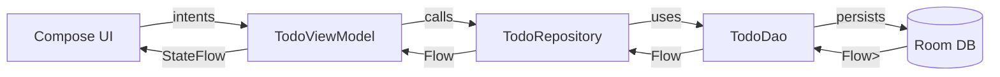
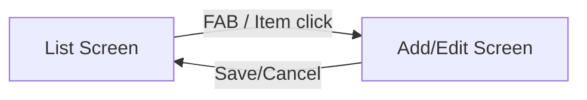

# To Do App X Horizon Beta

A simple, production-grade Android TODO app showcasing modern Kotlin + Jetpack Compose, MVVM, Repository pattern, Room persistence, Coroutines/Flows, Navigation, and Material3. The app includes unit tests and a lightweight ServiceLocator for dependency wiring.

App branding
- App name: to do app x horizon beta
- Credit line on list screen: Created by Horizon Beta Model

Features
- Create, edit, delete and toggle completion of tasks
- Persistent storage with Room
- Reactive list updates via Flow
- Add/Edit screen with validation
- Material3 UI with Compose
- Navigation between List and Add/Edit
- Unit tests for Repository and ViewModel

Tech Stack
- Kotlin, Coroutines, Flow
- Jetpack Compose UI + Material3
- Navigation-Compose
- MVVM (ViewModel + StateFlow)
- Room (via KSP)
- Manual DI with Application-level ServiceLocator
- JUnit4 test stack

Project Layout
- Gradle config: [app/build.gradle.kts](app/build.gradle.kts) | versions: [gradle/libs.versions.toml](gradle/libs.versions.toml)
- Android manifest: [app/src/main/AndroidManifest.xml](app/src/main/AndroidManifest.xml)
- Application + DI:
  - [app/src/main/java/com/example/todo_app/App.kt](app/src/main/java/com/example/todo_app/App.kt)
  - [app/src/main/java/com/example/todo_app/di/AppServiceLocator.kt](app/src/main/java/com/example/todo_app/di/AppServiceLocator.kt)
- Data (Room + Repository):
  - [app/src/main/java/com/example/todo_app/data/TodoEntity.kt](app/src/main/java/com/example/todo_app/data/TodoEntity.kt)
  - [app/src/main/java/com/example/todo_app/data/TodoDao.kt](app/src/main/java/com/example/todo_app/data/TodoDao.kt)
  - [app/src/main/java/com/example/todo_app/data/TodoDatabase.kt](app/src/main/java/com/example/todo_app/data/TodoDatabase.kt)
  - [app/src/main/java/com/example/todo_app/data/TodoRepository.kt](app/src/main/java/com/example/todo_app/data/TodoRepository.kt)
- UI + ViewModel + Navigation:
  - [app/src/main/java/com/example/todo_app/ui/TodoViewModel.kt](app/src/main/java/com/example/todo_app/ui/TodoViewModel.kt)
  - [app/src/main/java/com/example/todo_app/ui/TodoScreens.kt](app/src/main/java/com/example/todo_app/ui/TodoScreens.kt)
  - [app/src/main/java/com/example/todo_app/ui/NavGraph.kt](app/src/main/java/com/example/todo_app/ui/NavGraph.kt)
  - [app/src/main/java/com/example/todo_app/MainActivity.kt](app/src/main/java/com/example/todo_app/MainActivity.kt)
- Resources:
  - [app/src/main/res/values/strings.xml](app/src/main/res/values/strings.xml)
- Tests:
  - [app/src/test/java/com/example/todo_app/TodoRepositoryTest.kt](app/src/test/java/com/example/todo_app/TodoRepositoryTest.kt)
  - [app/src/test/java/com/example/todo_app/TodoViewModelTest.kt](app/src/test/java/com/example/todo_app/TodoViewModelTest.kt)

Architecture Overview
- MVVM:
  - View (Compose) renders UI from immutable state, sends user intents
  - ViewModel holds state in StateFlow, orchestrates use-cases via Repository
  - Repository coordinates Room DAO operations and exposes Flow for list
- Navigation:
  - Centralized NavHost with List and Add/Edit destinations
  - Nullable item id supported by using a String nav argument then parsing to Long?
- DI:
  - Application creates ServiceLocator providing Room database, Repository, and ViewModelFactory

High-Level Data Flow

Navigation Flow

Local Development

Prerequisites
- JDK 17
- Latest Android Studio (Giraffe+ recommended)
- Android SDK / Emulator

Build and Run
- Open the project in Android Studio
- Sync Gradle
- Run app on emulator or device

Gradle and KSP highlights
- KSP is enabled for Room codegen
- Room schemas generated via ksp arg (see [app/build.gradle.kts](app/build.gradle.kts))

Testing
- Unit tests:
  - Repository: in-memory Room for DAO/DB behavior
  - ViewModel: Fake repository, coroutine test dispatcher
- Run from Android Studio or CLI:
  - ./gradlew test

Key Design Decisions
- Nullable nav argument handled as String and parsed to Long? to avoid “long does not allow nullable values”
- One-off events from ViewModel via Channel/SharedFlow pattern for snackbars
- Local ServiceLocator over a full DI framework to keep footprint small

Extension Points
- Add search/filter/sort in DAO and Repository
- Add due dates, priorities, and categories in Entity
- Implement dark mode customization
- Add UI tests with Compose UI Test framework
- Introduce Hilt as DI alternative later

Troubleshooting
- If KSP or Room schema errors occur, re-sync Gradle and clean build
- Ensure JDK 17 is configured in Gradle settings
- Check Navigation imports are from androidx.navigation.* (compose routes use androidx.navigation.compose)

License
- MIT or project-specific (add if needed)